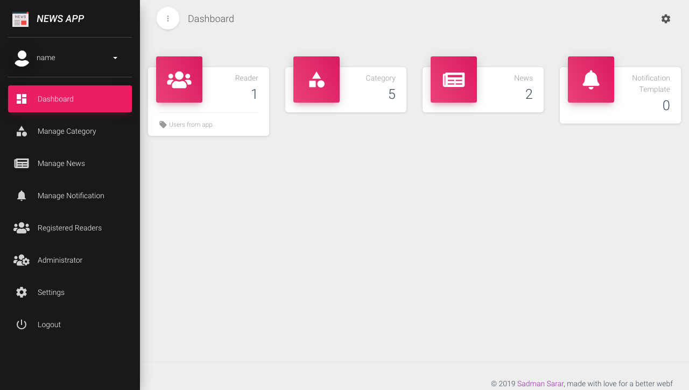
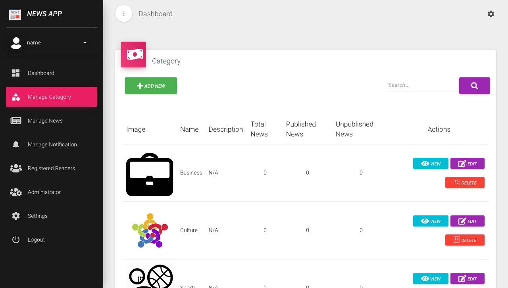
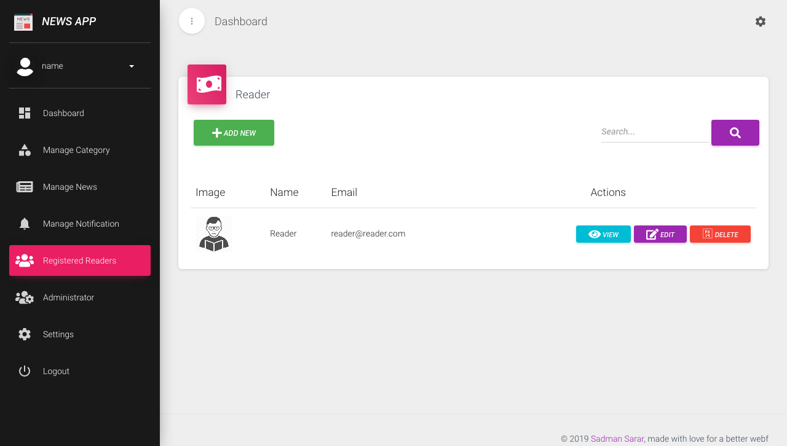
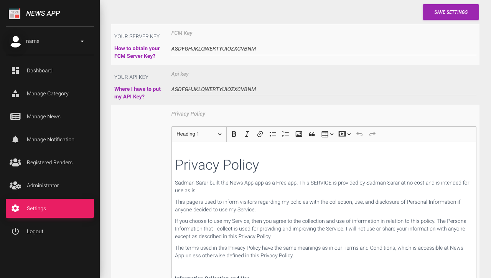

## About New App

This is a web application based on laravel framework build to support the flutter application built [here](https://github.com/SadmanSarar/flutter-news-app). 


##Installation Process

- Clone the repository
- Install composer. For details visit [this link](https://getcomposer.org/)
- open terminal in project directory and run command `composer install`
- create a mysql database
- copy `.env.example` and rename the copy `.env`
- fill up the following with appropriate data in `.env` file
```
DB_CONNECTION=mysql {Change if required}
DB_HOST=127.0.0.1 {Change if required}
DB_PORT=3306 {Change if required}
DB_DATABASE=YOUR_DB_NAME
DB_USERNAME=YOUR_DB_USER_NAME
DB_PASSWORD=YOUR_DB_PASSWORD
```
- run `php artisan key:generate`
- run `php artisan migrate`. 
- If you are running in you pc run `php artisan serve`

## Usage
- visit `APP_URL/login`
- default E-Mail Address: `admin@admin.com` and Password: `admin`

## Demo

- Visit [http://news-app.sadmansarar.xyz](http://news-app.sadmansarar.xyz) to see the live demo.
- Credentials :
```
    E-Mail Address: admin@admin.com 
    Password: admin
```











#TODO
- integrate notification system